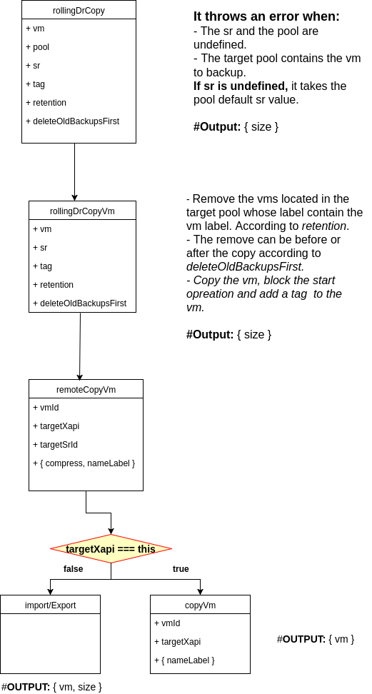
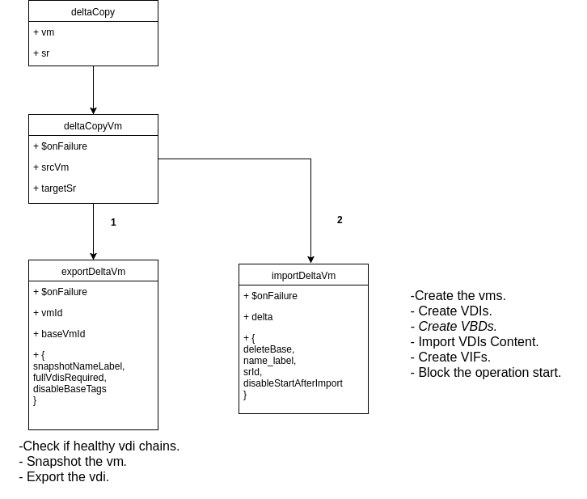
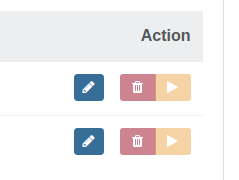

# Disaster recovery
Copies a VM to a target  pool, with a tagged name, and removes the oldest VMs with the same tag from this pool, according to retention.

## how it works ?
 

# continuous Replication
Delta copies a VM to a target  pool.

## how it works ?
 

# Revert implementation (Normal backup):
## Xo-Server:
### API/job
**Method:** revert
**Input:** jobId
**Body:**
```javascript
revertJob(jobId)
```
### xo-mixins/jobs
**Method:** revertJob
**Input:** jobId
**Body:**
1. **Getting the job:**
```javascript
let job = this.getJob(jobId)
```
2.**Getting the method:**
const method = job.method

3.**Getting the vms**
```javascript
const srId= job.paramsVector.items[1].values[0].sr
const sourceXapi = this._xo.getXapi(srId)
const sr = sourceXapi.getObject(srId)
const vms = []

// Add a tag to CR vms
forEach(sr.$VDIs, vdi => {
  const vbds = vdi.$VBDs
  const vm = vbds && vbds[0] && vbds[0].$VM
  if (vm && (method === 'vm.rollingDrCopy' && vm.tags.includes('Disaster Recovery') || method === 'vm.deltaCopy' && vm.tags.includes('Continuous Replication')) {
  	vms.push({id: vm.id})
  }
})

```
3.**Getting the obselete vms**
```javascript
const vmsToRemove = map(job.paramsVector.items[0].values, 'id')
```
4.**Getting the target SR**
```javascript
const oneVm = vmsToRemove[0]
const targetXapi =  this._xo.getXapi(oneVm)
const targetSr= targetXapi.getObject(
	targetXapi.getObject(oneVm).$pool
).default_SR
```
5.**Reverting the job**
```javascript
job.paramsVector.items[1].values[0].sr = targetSr
job.paramsVector.items[0].values = vms
```
6.**Setting the vms name_label and removing the tag**
```javascript
await Promise.all(map(vms, vm => {
	await targetXapi.editVm(vm, {
		name_label: method === 'vm.rollingDrCopy' ?  vm.name_label.split('_DR_')[0] :  vm.name_label.split(' (')[0]
	 })
	 await targetXapi.removeTag(vm, method === 'vm.rollingDrCopy' ? 'Disaster Recovery' : 'Continuous Replication')
}))
```
7.**Deleting the obselete vms**
```javascript
await Promise.all(map(vmsToRemove, vm =>
sourceXapi.deleteVm(vm)::pCatch(noop)
))
```
## Xo-Web:
### Backup/Overview
Adding a revert button to a DR/CR job (normal backup)
 
